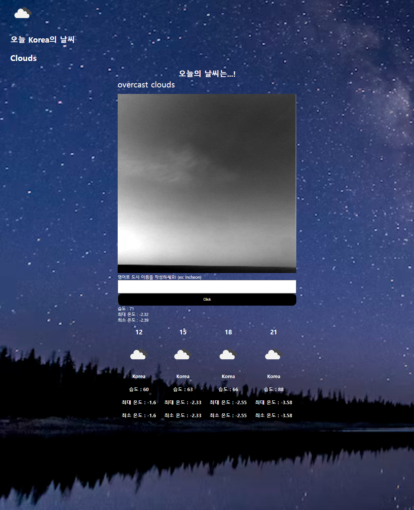
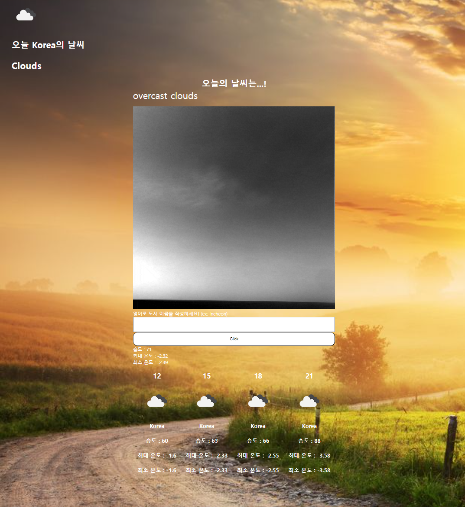
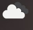

<!-- PROJECT LOGO -->
 

  

<h3 align="center">DramaProject</h3>

  

  Save and view your fav drama
  

<!-- TABLE OF CONTENTS -->

  
Table of Contents

  <ol>
    <li>
      <a href="#about-the-project">About The Project</a>
      <ul>
        <li><a href="#built-with">Built With</a></li>
      </ul>
    </li>
    <li><a href="#contact">Contact</a></li>
    <li><a href="#acknowledgments">Acknowledgments</a></li>
  </ol>

<!-- ABOUT THE PROJECT -->

## About The Project

window.onload event를 이용한 loading 화면

storage에 아무것도 포함되지 않은 홈 화면

 +버튼을 이용해서 total 이외에도 tab을 생성할 수 있습니다.

enter혹은 +버튼을 한번 더 누르면 tab 생성이 완료됩니다.

화면 상단의 +버튼을 누르면 form이 생성됩니다.

입력하는 text는 그대로 보여지고 파일 같은 경우 파일이 해당 칸을 채우게 됩니다.

form 생성을 완료하면 그것에 해당하는 카드를 생성합니다.

tab을 클릭하면 tab과 type이 같은 카드만 보여지게 됩니다.

comic에 해당하는 위의 카드는 comic tab을 클릭하면 보여집니다.

card에는 priority 옆에 remove라는 버튼이 있습니다. 해당 카드만 삭제하게 됩니다.

모든 tab을 삭제할 수 있는 버튼입니다.

(<a href="#readme-top">back to top</a>)

### Built With

- ![JavaScript][JavaScript.url]
- ![HTML5][HTML5.url]
- ![CSS3][CSS3.url]
- ![Webpack][Webpack.url]
- ![NPM][npm.url]

(<a href="#readme-top">back to top</a>)

<!-- CONTACT -->

## Contact

codefug

Project Link: [https://codefug.github.io/todoListProject/](https://codefug.github.io/todoListProject/)

(<a href="#readme-top">back to top</a>)

<!-- ACKNOWLEDGMENTS -->

## Acknowledgments

<ol>
    <li>이번 프로젝트의 중점은 localstorage 지식 습득과 함수형 프로그래밍에 대해서, 객체 지향성을 생각하면서 효율적으로 확장성 있게 구현하는 것이다.</li>
     
    <li>loading</li>
      <ul>
        <li>window의 onload event를 이용하여 loading화면을 구현하였다.</li>
      </ul>
     
    <li>storage</li>
    <ul>
        <li>storage에는 CRUD 기능이 다 존재하며 storage.js라는 파일에 object형식(todo card)이든 string형식(tab)이든 상관없이 storage CRUD기능을 구현하는 것이 목표였다.</li>
        <li>localSorage에는 JS형식으로 파일이 들어가기 때문에 JS.parse() 나 JS.stringify()을 사용하여 간단하게 구현할 수도 있었다. 하지만 tab의 경우 string하나 이기 때문에 배열로 형성하여 넣는 방식이 간단하고 todo item의 경우 Object방식이기 때문에 꺼낸 후 다른 object를 넣게 되면 overwrite되는 등 문제가 발생했다.</li>
        <ol>
          <li>storage안의 데이터는 배열 방식으로 CRUD를 구현하여 각 object와 string을 동시에 처리할 수 있도록 하였다.</li>
          <li>만약 object라면 추가 parameter를 통하여 다른 동작을 추가로 하도록하여 확장성을 키웠다.</li>
        </ol>
    </ul>
    <li>tabaction</li>
        <ul>
            <li>+라는 기본 tab을 기준으로 그 전에 tab을 더하는 방식으로 진행된다.</li>
            <li>
            document.insertBefore() 함수를 이용하여 menu라는 div안에서 + 기본 tab이전에 input을 형성하게 된다.
            </li>
            <li>
            input이 활성화되어 있을 때 click이나 enter를 누르게 되면 두가지 경우가 발생한다.
            <ul>
            <li>input이 비어있다면 input에 focus가 이동된다.</li>
            <li>input이 채워져 있다면 tab이 형성된다.</li>
            </ul>
            <li>확장성을 위해 addTab이라는 초기화면에서 쓸 storage에서 value를 가져와서 tab을 만들거나 새로 만들 때 입력받은 name으로 tab을 만드는 함수를 하나가 될수 있도록 설계한다.</li>
            </li>
        </ul>
    <li>todo card</li>
        <ul>
            <li>click된 tab을 기준(초기화면에서는 total tab을 기본으로 클릭한 것으로 간주된다.)으로 해당 type을 가진 todocard를 생성하는 함수인 sort로 관리된다.</li>
            <li>todocard를 만드는 함수에는 DOM처리로 생성하는 것과 함께 remove button에 함수를 추가하게 되는데 이 버튼을 누르면 storage함수와 연동되어 storage에서 값을 삭제하면서 화면에서도 삭제한다.</li>
        </ul>
    <li>form</li>
        <ul>
            <li>form 설정은 dialog라는 html 요소로 생성된다.</li>
            <li>dialog를 js로 modal방식으로 열면 dialog안의 요소들을 볼 수 있다.</li>
            <li>file selector에서 file을 선택하면 해당 file을 FileReader라는 object을 이용하여 onload event에 event.target.result안에 있는 url을 꺼내서 file label background image에 적용시킨다.</li>
        </ul>
</ol>

(<a href="#readme-top">back to top</a>)

<!-- MARKDOWN LINKS & IMAGES -->
<!-- https://www.markdownguide.org/basic-syntax/#reference-style-links -->

[JavaScript.url]: https://img.shields.io/badge/javascript-%23323330.svg?style=for-the-badge&logo=javascript&logoColor=%23F7DF1E
[HTML5.url]: https://img.shields.io/badge/html5-%23E34F26.svg?style=for-the-badge&logo=html5&logoColor=white
[CSS3.url]: https://img.shields.io/badge/css3-%231572B6.svg?style=for-the-badge&logo=css3&logoColor=white
[Webpack.url]: https://img.shields.io/badge/webpack-%238DD6F9.svg?style=for-the-badge&logo=webpack&logoColor=black
[npm.url]: https://img.shields.io/badge/NPM-%23CB3837.svg?style=for-the-badge&logo=npm&logoColor=white
