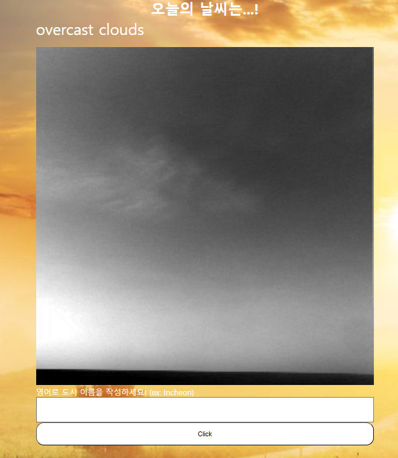

<!-- PROJECT LOGO -->
 

  

<h3 align="center">WeatherAppProject</h3>

  

    Choose The Weather 
    
장소를 검색하고 data를 Fahrenheit, Celsius로 나타낼 수 있어야 한다.

    
날씨에 기반해서 배경 색상을 변경하거나 날씨를 설명하는 이미지를 추가하여 페이지 모양을 
    변경해야 한다. Giphy api를 사용하여 적절한 날씨 관련 GIF를 찾아 표시

    
async/await, promise를 꼭 써야한다.

    
시간에 따라서 배경화면 변경, color변경, button 색깔 변경, footer만들고 loading화면 만들기

  

<!-- TABLE OF CONTENTS -->

  
Table of Contents

  <ol>
    <li>
      <a href="#about-the-project">About The Project</a>
      <ul>
        <li><a href="#built-with">Built With</a></li>
      </ul>
    </li>
    <li><a href="#contact">Contact</a></li>
    <li><a href="#acknowledgments">Acknowledgments</a></li>
  </ol>

<!-- ABOUT THE PROJECT -->

## About The Project

window.onload event를 이용한 loading 화면

storage에 아무것도 포함되지 않은 홈 화면

 +버튼을 이용해서 total 이외에도 tab을 생성할 수 있습니다.

enter혹은 +버튼을 한번 더 누르면 tab 생성이 완료됩니다.

화면 상단의 +버튼을 누르면 form이 생성됩니다.

입력하는 text는 그대로 보여지고 파일 같은 경우 파일이 해당 칸을 채우게 됩니다.

form 생성을 완료하면 그것에 해당하는 카드를 생성합니다.

tab을 클릭하면 tab과 type이 같은 카드만 보여지게 됩니다.

comic에 해당하는 위의 카드는 comic tab을 클릭하면 보여집니다.

card에는 priority 옆에 remove라는 버튼이 있습니다. 해당 카드만 삭제하게 됩니다.

모든 tab을 삭제할 수 있는 버튼입니다.

(<a href="#readme-top">back to top</a>)

### Built With

- ![JavaScript][JavaScript.url]
- ![HTML5][HTML5.url]
- ![CSS3][CSS3.url]
- ![Webpack][Webpack.url]
- ![NPM][npm.url]

(<a href="#readme-top">back to top</a>)

<!-- CONTACT -->

## Contact

codefug

Project Link: [https://codefug.github.io/todoListProject/](https://codefug.github.io/todoListProject/)

(<a href="#readme-top">back to top</a>)

<!-- ACKNOWLEDGMENTS -->

## Acknowledgments

<ol>
    <li>Open Weather api를 적용시키는 과정</li>
    <ul>
    <li>처음에 open weather라는 사이트의 api를 사용해서 하려고 geocoding이라는 api까지는 받아서 지역명을 받으면 위도랑 경도를 받는 로직까지는 구현을 했는데 daily관련 이 위도와 경도를 받아서 날씨를 나타내는 api가 유료라서 실패했다.</li>
    <li>찾아보니 5일/3시간 예보자료는 무료라 그래서 했더니 되었다. 개발자가 읽는 것을 잘해야 된다는 걸 다시 한번 느낀다.</li>
     
    <li>계속 헤매다가 결국 이름으로 입력받았을 때 위도와 경도를 알려주는 api가 이름과 중복되는 그러니깐 전세계에서 같은 이름이 나오는 5개의 리스트를 뽑게 한다는 걸 알았고 그 5개 중에 korea에 해당하는 값이 없다는 걸 확인했다. geocoding의 오류라고 판단, 더 찾아본 결과 5일/3시간 api document에 아예 이름을 받아서 꺼내는 api가 있음을 확인했고 이를 적용하여 되는 것을 확인했다.</li>
    </ul>
    <li>textContent를 DOM처리로 조작할 때 new line이 적용되지 않음.</li>
    <ul>
    <li>/r/n으로 textContent안에 넣어주고 white-space:pre-line을 해주어서 공백 문자를 줄바꿈으로 처리하게 해주면 된다.</li>
    </ul>
     
    <li>JS로 backgroundImage설정</li>
    <ul>
      <li>JS로 backgroundImage를 설정하려면 웹팩에서 이미지를 가져오고 그 이미지를 CSS형식에 맞춰서 즉,
      element.style.backgroundImage=`url({imageurl})`형식을 맞춰야 이미지가 적용된다.</li>
    </ul>
    <li>로딩 화면 구현</li>
    <ul>
      <li>원래는 의미 없이 2초를 주고 로딩화면을 없애는 방식으로 만들었었는데 이제 async await을 이용해서 API로 받아온 데이터가 활용되어 이미지에 넣어지거나 아니면 아이콘 생성, 습도 온도 등을 다 바꾸게 된 후에 페이지가 열릴 수 있도록 구현하였다.</li>
      <li>조금 더 깔끔하게 페이지가 구성되어진 것 같다.</li>
    </ul>
    <li>모든 함수의 문서화, 설계</li>
    <ul>
      <li>어떤 함수를 만들기 전에 설계를 먼저해서 어디서 재사용할 수 있을지를 계획하고 문서화하면 개발 기간을 훨씬 줄일 수 있다.</li>
      <li>이번 프로젝트를 통해서 이러한 문서화, 설계의 중요성을 깨닫게 되었고 API를 활용하여 많은 사이트들과 소통하고 싶어졌다.</li>
    </ul>
</ol>

(<a href="#readme-top">back to top</a>)

<!-- MARKDOWN LINKS & IMAGES -->
<!-- https://www.markdownguide.org/basic-syntax/#reference-style-links -->

[JavaScript.url]: https://img.shields.io/badge/javascript-%23323330.svg?style=for-the-badge&logo=javascript&logoColor=%23F7DF1E
[HTML5.url]: https://img.shields.io/badge/html5-%23E34F26.svg?style=for-the-badge&logo=html5&logoColor=white
[CSS3.url]: https://img.shields.io/badge/css3-%231572B6.svg?style=for-the-badge&logo=css3&logoColor=white
[Webpack.url]: https://img.shields.io/badge/webpack-%238DD6F9.svg?style=for-the-badge&logo=webpack&logoColor=black
[npm.url]: https://img.shields.io/badge/NPM-%23CB3837.svg?style=for-the-badge&logo=npm&logoColor=white

[]
