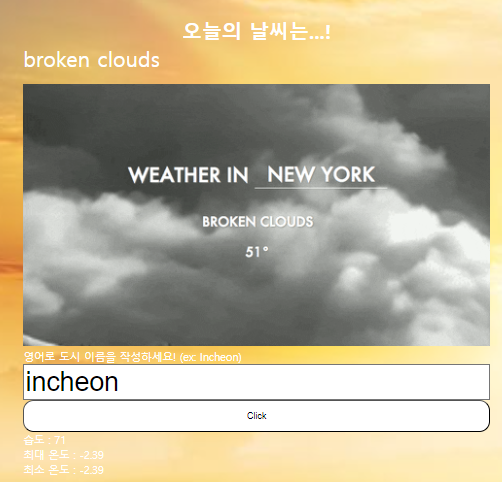
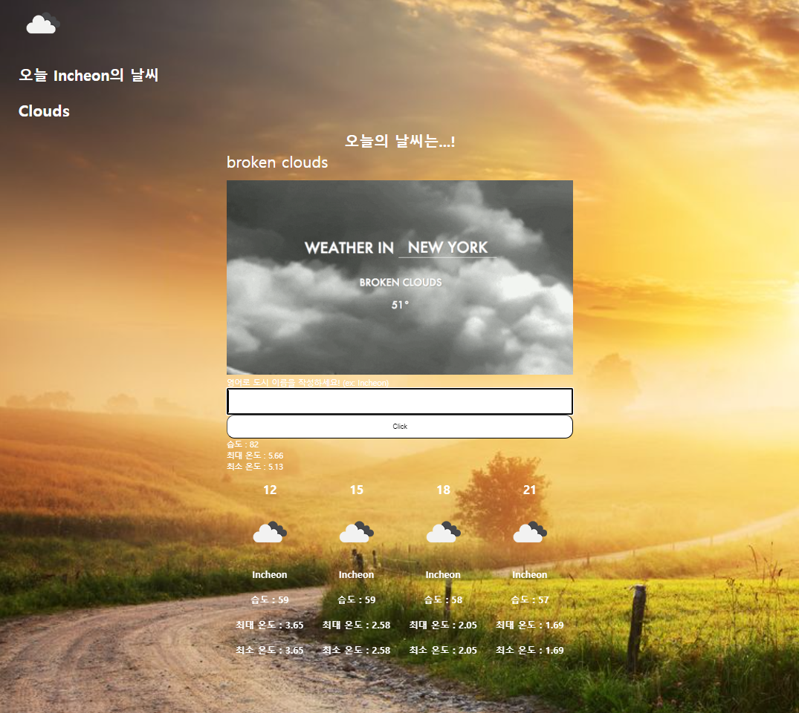

## introduction
<!-- PROJECT LOGO -->
 

  

<h3 align="center">WeatherAppProject</h3>

  

    Choose The Weather 
    
open weather API를 이용해서 비동기적으로 데이터를 저장한 후 검색한 도시의 날씨에 대한 정보를 확인할 수 있는 앱을 제작한다
  

<!-- TABLE OF CONTENTS -->

  
Table of Contents

  <ol>
    <li>
      <a href="#about-the-project">About The Project</a>
      <ul>
        <li><a href="#built-with">Built With</a></li>
      </ul>
    </li>
    <li><a href="#contact">Contact</a></li>
    <li><a href="#Experience">Acknowledgments</a></li>
  </ol>

<!-- ABOUT THE PROJECT -->

## About The Project

로딩 화면 입니다. 비동기적으로 모든 화면 구성 요소에 대한 함수들이 끝나면 종료됩니다.

메인 화면입니다. 아래에는 습도 최대 온도 최소 온도 그리고 위쪽에 이것들이 일어나는 시간을 의미합니다. 가운데 사진은 해당 날씨에 대한 랜덤한 사진이 올라가게 됩니다.

입력창입니다. 도시 키워드를 첫 화면에서는 Korea로 설정되어 있습니다. 

incheon을 입력해보겠습니다.

Incheon으로 설정된 것을 확인할 수 있습니다.

각 아이콘은 현재 날씨에 대한 아이콘을 나타냅니다. 현재는 구름이 있는 날씨입니다.

지금은 시간이 지나게 되면 자동으로 배경화면이 밤 낮 으로 바뀌게 됩니다. 위의 사진은 밤에 일어나는 변화를 나타냅니다.

(<a href="#introduction">back to top</a>)

### Built With

- ![JavaScript][JavaScript.url]
- ![HTML5][HTML5.url]
- ![CSS3][CSS3.url]
- ![Webpack][Webpack.url]
- ![NPM][npm.url]

(<a href="#introduction">back to top</a>)

<!-- CONTACT -->

## Contact

codefug

Project Link: [https://github.com/codefug/WeatherAppProject](https://github.com/codefug/WeatherAppProject)

(<a href="#introduction">back to top</a>)

<!-- ACKNOWLEDGMENTS -->

## Experience

<ol>
    <li>Open Weather api를 적용시키는 과정</li>
    <ul>
    <li>처음에 open weather라는 사이트의 api를 사용해서 하려고 geocoding이라는 api까지는 받아서 지역명을 받으면 위도랑 경도를 받는 로직까지는 구현을 했는데 daily관련 이 위도와 경도를 받아서 날씨를 나타내는 api가 유료라서 실패했다.</li>
    <li>찾아보니 5일/3시간 예보자료는 무료라 그래서 했더니 되었다. 개발자가 읽는 것을 잘해야 된다는 걸 다시 한번 느낀다.</li>
     
    <li>계속 헤매다가 결국 이름으로 입력받았을 때 위도와 경도를 알려주는 api가 이름과 중복되는 그러니깐 전세계에서 같은 이름이 나오는 5개의 리스트를 뽑게 한다는 걸 알았고 그 5개 중에 korea에 해당하는 값이 없다는 걸 확인했다. geocoding의 오류라고 판단, 더 찾아본 결과 5일/3시간 api document에 아예 이름을 받아서 꺼내는 api가 있음을 확인했고 이를 적용하여 되는 것을 확인했다.</li>
    </ul>
    <li>textContent를 DOM처리로 조작할 때 new line이 적용되지 않음.</li>
    <ul>
    <li>/r/n으로 textContent안에 넣어주고 white-space:pre-line을 해주어서 공백 문자를 줄바꿈으로 처리하게 해주면 된다.</li>
    </ul>
     
    <li>JS로 backgroundImage설정</li>
    <ul>
      <li>JS로 backgroundImage를 설정하려면 웹팩에서 이미지를 가져오고 그 이미지를 CSS형식에 맞춰서 즉,
      element.style.backgroundImage=`url({imageurl})`형식을 맞춰야 이미지가 적용된다.</li>
    </ul>
    <li>로딩 화면 구현</li>
    <ul>
      <li>원래는 의미 없이 2초를 주고 로딩화면을 없애는 방식으로 만들었었는데 이제 async await을 이용해서 API로 받아온 데이터가 활용되어 이미지에 넣어지거나 아니면 아이콘 생성, 습도 온도 등을 다 바꾸게 된 후에 페이지가 열릴 수 있도록 구현하였다.</li>
      <li>조금 더 깔끔하게 페이지가 구성되어진 것 같다.</li>
    </ul>
    <li>모든 함수의 문서화, 설계</li>
    <ul>
      <li>어떤 함수를 만들기 전에 설계를 먼저해서 어디서 재사용할 수 있을지를 계획하고 문서화하면 개발 기간을 훨씬 줄일 수 있다.</li>
      <li>이번 프로젝트를 통해서 이러한 문서화, 설계의 중요성을 깨닫게 되었고 API를 활용하여 많은 사이트들과 소통하고 싶어졌다.</li>
    </ul>
</ol>

(<a href="#introduction">back to top</a>)

<!-- MARKDOWN LINKS & IMAGES -->
<!-- https://www.markdownguide.org/basic-syntax/#reference-style-links -->

[JavaScript.url]: https://img.shields.io/badge/javascript-%23323330.svg?style=for-the-badge&logo=javascript&logoColor=%23F7DF1E
[HTML5.url]: https://img.shields.io/badge/html5-%23E34F26.svg?style=for-the-badge&logo=html5&logoColor=white
[CSS3.url]: https://img.shields.io/badge/css3-%231572B6.svg?style=for-the-badge&logo=css3&logoColor=white
[Webpack.url]: https://img.shields.io/badge/webpack-%238DD6F9.svg?style=for-the-badge&logo=webpack&logoColor=black
[npm.url]: https://img.shields.io/badge/NPM-%23CB3837.svg?style=for-the-badge&logo=npm&logoColor=white